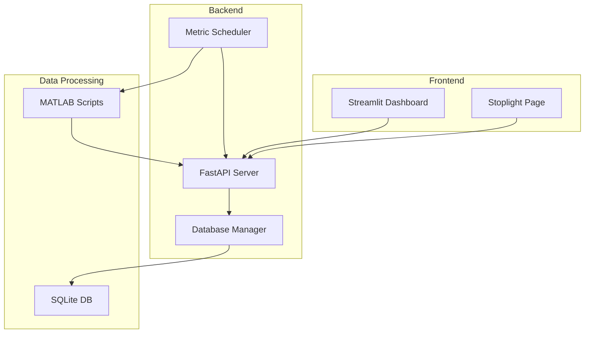
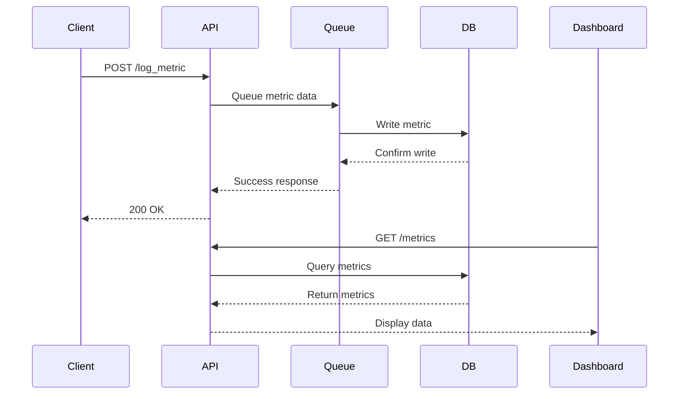
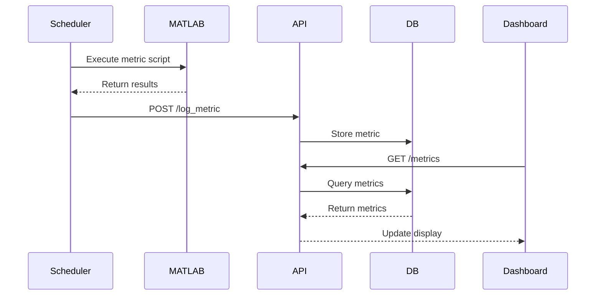

# ASTRA V2

A system for monitoring and analyzing spacecraft metrics with real-time visualization and alerting capabilities.

## Project Structure

```
ASTRA_V2/
├── config/                 # Configuration files
│   └── db_config.json     # Database and metric configurations
├── data/                  # Data storage
│   └── output/           # JSON output files
├── src/                  # Source code
│   ├── api/             # API related code
│   │   └── main.py      # FastAPI application
│   ├── streamlit/       # Dashboard application
│   │   ├── streamlit_app.py    # Main dashboard
│   │   └── pages/             # Additional pages
│   │       └── stoplight.py   # Stoplight status page
│   ├── database/        # Database operations
│   │   └── db_manager.py      # SQLite database manager
│   ├── scheduler/       # Metric scheduling
│   │   └── schedule_runner.py # Metric execution scheduler
│   ├── metrics/         # Metric calculation scripts
│   │   ├── runMetric1.m      # Temperature metric
│   │   └── runMetric2.m      # Pressure metric
│   └── utils/           # Utility functions
│       └── config.py    # Configuration loader
└── requirements.txt      # Python dependencies
```

## High-Level Architecture



## Main Components

### 1. FastAPI Backend (`src/api/main.py`)
- **Endpoints:**
  - `GET /`: API information
  - `POST /log_metric`: Log new metric data
  - `GET /metrics`: Retrieve metrics with filtering
  - `GET /health`: System health check

### 2. Streamlit Dashboard (`src/streamlit/`)
- **Main Dashboard (`streamlit_app.py`):**
  - Time series visualization
  - Metric filtering by SCID
  - Real-time data updates
- **Stoplight Page (`pages/stoplight.py`):**
  - Color-coded status indicators
  - Breach statistics
  - Time range analysis

### 3. Database Manager (`src/database/db_manager.py`)
- SQLite database operations
- Metric data storage and retrieval
- Automatic table initialization

### 4. Scheduler (`src/scheduler/schedule_runner.py`)
- Scheduled metric calculations
- MATLAB script execution
- Automatic metric logging

### 5. Metrics (`src/metrics/`)
- MATLAB scripts for metric calculations
- Temperature monitoring (`runMetric1.m`)
- Pressure monitoring (`runMetric2.m`)

## API Documentation

### Endpoints

| Method | Endpoint | Description | Request Body | Response |
|--------|----------|-------------|--------------|-----------|
| GET | `/` | API information | - | API details |
| POST | `/log_metric` | Log new metric | Metric data | Success status |
| GET | `/metrics` | Get metrics | Query params | Metric list |
| GET | `/health` | System health | - | Health status |

### Request/Response Examples

#### POST /log_metric
```json
{
    "scid": "1",
    "time": "2024-02-20 10:00:00",
    "metric": "temperature",
    "value": 26.5,
    "threshold": 25.5
}
```

#### GET /metrics
Query Parameters:
- `metric` (optional): Filter by metric name
- `scid` (optional): Filter by spacecraft ID
- `limit` (default: 30): Number of records to return

## Main Functions

### API Functions
```python
async def log_metric(data: Metric)
    """Log new metric data to the system"""
    # Validates and queues metric data for processing

def get_metrics(metric: str = None, scid: str = None, limit: int = 30)
    """Retrieve metrics with optional filtering"""
    # Returns filtered metric data from database

def health()
    """Check system health status"""
    # Returns queue size and total metrics count
```

### Database Functions
```python
def insert_metric(metric_data: Dict[str, Any]) -> bool
    """Insert a metric into the database"""
    # Stores metric data with verification

def get_metrics(scid: str = None, metric: str = None, limit: int = 10)
    """Retrieve metrics with optional filtering"""
    # Returns filtered metrics from database
```

### Dashboard Functions
```python
def fetch_data()
    """Fetch metrics from the API"""
    # Retrieves data for visualization

def get_stoplight_color(value, threshold)
    """Get stoplight color based on value and threshold"""
    # Returns color indicator for metric status

def calculate_breaches(df, metric, scid)
    """Calculate number of breaches for a metric/SCID"""
    # Computes breach statistics
```

## Sequence Diagrams

### Metric Logging Flow

!api.png

### Metric Monitoring Flow


## Setup

1. Install Python dependencies:
   ```bash
   pip install -r requirements.txt
   ```

2. Configure metrics in `config/db_config.json`:
   - Set database path
   - Configure API port
   - Define metrics and thresholds

3. Start the API server:
   ```bash
   python src/api/main.py
   ```

4. Start the Streamlit dashboard:
   ```bash
   streamlit run src/streamlit/streamlit_app.py
   ```

5. Start the metric scheduler:
   ```bash
   python src/scheduler/schedule_runner.py
   ```

## Features

- Real-time metric monitoring
- Configurable thresholds per SCID
- Color-coded status indicators
- Breach statistics and analysis
- Time series visualization
- RESTful API for data access
- Scheduled metric calculations
- SQLite database storage
- MATLAB integration for calculations